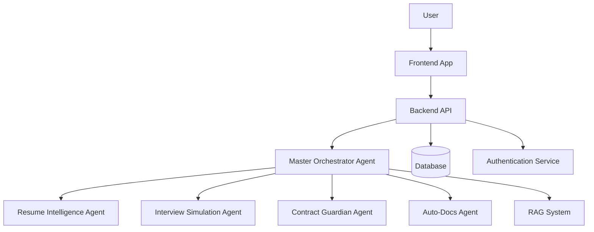

# CareerFlow AI Architecture

This document describes the architectural design of CareerFlow AI.

## High-Level Architecture

## Component Descriptions

### Frontend Application
- **Technology**: React + TypeScript + Tailwind CSS + Framer Motion
- **Purpose**: Provides user interface for all career services
- **Features**:
  - Animated landing page
  - Interactive dashboards
  - Real-time feedback displays
  - Responsive design

### Backend API
- **Technology**: FastAPI + Python
- **Purpose**: Serves as the central hub for all application logic
- **Features**:
  - RESTful API endpoints
  - Authentication and authorization
  - Request routing and validation
  - Database integration

### Master Orchestrator Agent
- **Purpose**: Central coordinator for all specialized agents
- **Responsibilities**:
  - Route requests to appropriate agents
  - Manage context sharing between agents
  - Coordinate complex workflows
  - Aggregate responses from multiple agents

### Specialized Agents

#### Resume Intelligence Agent
- **Function**: Resume analysis and optimization
- **Capabilities**:
  - ATS compatibility checking
  - Keyword optimization
  - Formatting suggestions
  - Industry-specific recommendations

#### Interview Simulation Agent
- **Function**: Mock interview generation and feedback
- **Capabilities**:
  - Role-specific question generation
  - Behavioral interview preparation
  - Technical assessment creation
  - Performance feedback

#### Contract Guardian Agent
- **Function**: Employment contract review
- **Capabilities**:
  - Risk identification
  - Clause explanation
  - Negotiation suggestions
  - Legal compliance checking

#### Auto-Docs Agent
- **Function**: Automated document generation
- **Capabilities**:
  - Cover letter creation
  - Portfolio development
  - Achievement documentation
  - Reference letter generation

### Supporting Services

#### RAG System
- **Purpose**: Retrieval-Augmented Generation for enhanced accuracy
- **Components**:
  - Vector database for knowledge storage
  - Embedding models for semantic search
  - Document retrieval mechanisms

#### Database
- **Technology**: SQLite (development) / PostgreSQL (production)
- **Purpose**: Persistent storage for user data and documents
- **Schema**:
  - Users table
  - Documents table
  - Sessions table
  - Feedback records

#### Authentication Service
- **Purpose**: Secure user authentication and session management
- **Features**:
  - JWT-based token system
  - Password hashing and verification
  - Session timeout handling

## Data Flow

1. **User Interaction**: User interacts with frontend application
2. **API Request**: Frontend sends requests to backend API
3. **Request Routing**: Backend routes request to Master Orchestrator
4. **Agent Coordination**: Orchestrator determines required agents
5. **Task Execution**: Specialized agents process requests
6. **Knowledge Retrieval**: Agents query RAG system when needed
7. **Response Aggregation**: Orchestrator combines agent responses
8. **Result Delivery**: Backend returns results to frontend
9. **UI Update**: Frontend updates interface with results

## Scalability Considerations

- **Horizontal Scaling**: Agents can be scaled independently
- **Load Balancing**: API layer can distribute requests
- **Caching**: Frequently accessed data cached for performance
- **Database Sharding**: User data can be partitioned by region
- **Microservices**: Components can be separated into independent services

## Security Measures

- **Data Encryption**: All sensitive data encrypted at rest
- **Secure Communication**: HTTPS/TLS for all communications
- **Input Validation**: Strict validation on all API inputs
- **Rate Limiting**: Prevent abuse through request limiting
- **Audit Logging**: Track all user actions and system events